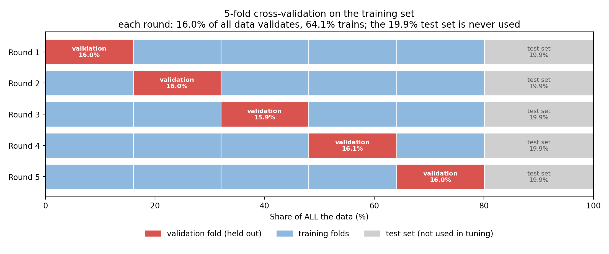
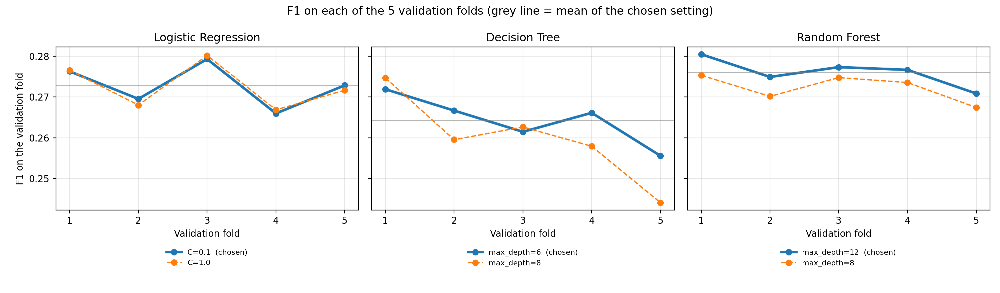
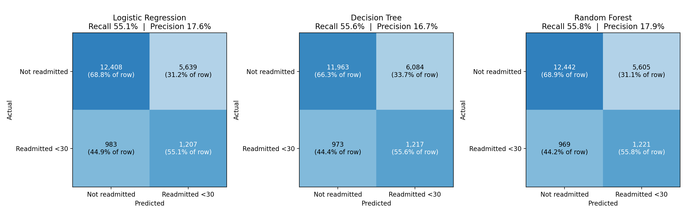

# Diabetes 30-Day Readmission Prediction

A machine learning pipeline that predicts whether a diabetic patient will be readmitted to hospital within 30 days, built from the UCI "Diabetes 130-US hospitals" dataset (`diabetic_data.csv`).

This is a University of Limpopo group project (SCOA032). The code follows the approach set out in the group presentation, rebuilt from the raw data one phase at a time so every step can be traced and explained. Each script prints its results to the terminal and writes no log files.

## Repository contents

| File | What it does | Why it is a separate file |
| --- | --- | --- |
| `clean_data.py` | Phases 1-3: inspects the raw data, cleans it, builds the target and the feature set. | Data preparation is done once. Keeping it apart means modelling can be re-run without repeating it. |
| `train_and_tuning.py` | Phases 4-5: splits the data, then trains and tunes three models with cross-validation, and draws the cross-validation pictures. | Training is the slowest step, so it is isolated from evaluation. |
| `evaluate_models.py` | Phase 6: evaluates the tuned models on the held-out test set and produces the charts. | Evaluation can be re-run quickly without retraining. |
| `.gitignore` | Keeps the dataset and large generated files out of the repository. | See "Files not included" below. |
| `docs/` | One document per group of phases, with every number and the reason for each step. | Keeps the explanation next to the code. |

## How to run

Run the scripts in this order, from one folder:

1. **Get the data.** Download `diabetic_data.csv` from the UCI Machine Learning Repository ("Diabetes 130-US hospitals for years 1999-2008") and place it in the same folder as the scripts.
2. `python clean_data.py`
3. `python train_and_tuning.py`
4. `python evaluate_models.py`

**Requirements:** Python 3 with `pandas`, `numpy`, `scikit-learn`, `matplotlib` and `joblib`. The project was run on Python 3.11.

The order matters because each script reads the files the previous one wrote.

| Script | Creates |
| --- | --- |
| `clean_data.py` | `diabetic_cleaned.csv`, `diabetic_features.csv` |
| `train_and_tuning.py` | `train_split.csv`, `test_split.csv`, `cv_results_phase5.csv`, `cv_fold_scores_phase5.csv`, `best_models.joblib`, `cv_folds_structure_phase5.png`, `cv_f1_by_fold_phase5.png` |
| `evaluate_models.py` | `evaluation_results.csv`, `feature_importance_random_forest.csv`, `confusion_matrices.png`, `precision_recall_curve.png`, `threshold_analysis.png`, `top_predictors.png` |

## Method and reasons

**Cleaning (Phases 1-2).** The raw data has 101,766 rows and 50 columns. Eight columns were dropped (an ID, columns that are mostly missing, and two with a single value), and 3 rows with an invalid gender were removed, leaving **101,763 rows**. Missing race and diagnosis values were relabelled as "Unknown" and "Missing" so no rows were lost. The 2,423 rows where the patient died or went to hospice were kept, which is a known limitation: these patients cannot be readmitted, so they may influence the results.

**Target and features (Phase 3).** The target is readmission within 30 days (11.16% of rows). The model uses 40 features. The diagnosis codes (`diag_1` to `diag_3`, about 700 to 800 codes each) are grouped into 10 clinical categories, because the raw codes are too sparse to learn from. Only the original columns are used, with no engineered features, to stay consistent with the presentation.

**Splitting (Phase 4).** The data is split 80% train (81,526 rows) and 20% test (20,237 rows) with seed 42. The split is stratified by the target, so both parts keep a similar readmission rate, and grouped by patient, so one patient's visits never appear in both parts. Without grouping, the model could memorise a patient it saw in training and inflate the test scores.

**Models and tuning (Phase 5).** Three models were used, as in the presentation: Logistic Regression, Decision Tree and Random Forest.

- **Class imbalance** is handled with `class_weight='balanced'`, which makes a missed early readmission cost about 8 times more than a false alarm during training. No rows are added, removed or copied.
- **Cross-validation:** hyperparameters are tuned with patient-grouped, stratified 5-fold cross-validation on the 80% training portion only, so the test set is never used for tuning. Each validation fold is about 16% of the full data (a fifth of the 80%), and each round trains on about 64%. The 16% is the size of a fold, not a separate setting.
- **Selection score:** models are chosen on F1, which balances precision and recall. Accuracy alone would reward predicting "not readmitted" for everyone.
- **Light tuning:** one setting is tuned per model and the other is fixed, which keeps the search small (30 fits). The fixed values came from an earlier full-grid run that also used cross-validation on the training set only.

| Model | Chosen settings | CV F1 |
| --- | --- | --- |
| Logistic Regression | C = 0.1 (C = 1.0 scored the same) | 0.273 |
| Decision Tree | max_depth = 6, min_samples_leaf = 50 (fixed) | 0.264 |
| Random Forest | max_depth = 12, min_samples_leaf = 20 (fixed), 100 trees | 0.276 |

**Evaluation (Phase 6).** The test set is used once, to report results, with the default rule (flag a patient when the predicted probability is above 0.5). Results:

| Model | F1 | Recall | Precision | Early readmissions caught |
| --- | --- | --- | --- | --- |
| Logistic Regression | 0.267 | 0.551 | 0.176 | 1,207 of 2,190 |
| Decision Tree | 0.256 | 0.556 | 0.167 | 1,217 of 2,190 |
| Random Forest (final) | 0.271 | 0.558 | 0.179 | 1,221 of 2,190 |

Random Forest was chosen as the final model. Its lead is small, so the choice should not be over-interpreted. Test scores are 0.005 to 0.008 below the cross-validation scores, about the size of the variation between folds. A threshold analysis on the training data showed that the default 0.5 is at or near the best F1 point for all three models.

**Main finding.** `number_inpatient` and `discharge_disposition_id` dominate the importance ranking (permutation importance), and 23 of the 40 factors add little or nothing. The discharge feature may partly reflect the death and hospice rows that were kept. The model is a screening aid, not a diagnosis: about 4 in 5 flagged patients are false alarms.

## Documentation

| Document | Covers |
| --- | --- |
| [`docs/PHASE1-3_clean_data_documentation.md`](docs/PHASE1-3_clean_data_documentation.md) | Inspecting, cleaning and preparing the data |
| [`docs/PHASE4-5_train_and_tuning_documentation.md`](docs/PHASE4-5_train_and_tuning_documentation.md) | The split, preprocessing, class weighting, cross-validation and tuning |
| [`docs/PHASE6_evaluate_models_documentation.md`](docs/PHASE6_evaluate_models_documentation.md) | Test-set results, thresholds, predictors and limitations |

## Files not included

The repository contains code, documents and pictures only. These are excluded by `.gitignore` because they are large and are recreated by running the scripts:

- `diabetic_data.csv` (raw dataset, download it from UCI)
- `diabetic_cleaned.csv`, `diabetic_features.csv`, `train_split.csv`, `test_split.csv`
- `*.joblib` (saved models)

## Limitations

- Death and hospice-discharge rows were kept, as described above.
- F1 scores are modest (about 0.26 to 0.27), which reflects how hard 30-day readmission is to predict from these columns alone.
- The models catch about 55% of early readmissions, and roughly 4 in 5 flagged patients are false alarms.
- Differences between the three models are small.
- Results come from a single 80/20 split, and no confidence interval was calculated for the test scores.
- The choice of 5 folds is a convention and was not compared against other values.
